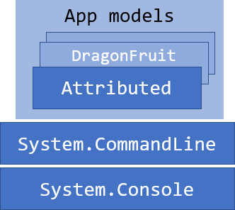

# Devlooped.CommandLine.Attributed

An application model on top of System.CommandLine that leverages attributed classes 
and methods to build a CLI app.

Conceptually, the *Attributed* app model provided in this project builds on top of 
the [underlying layering](https://github.com/dotnet/command-line-api/blob/main/docs/Layering.md) 
in `System.CommandLine`:

